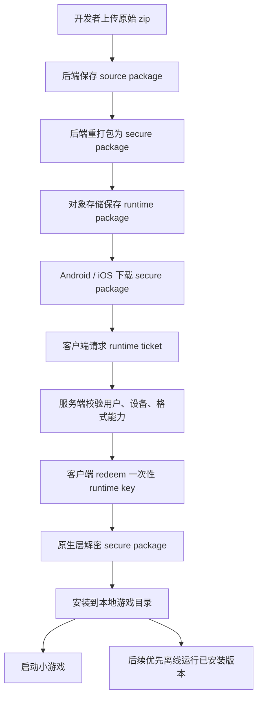

# 小游戏安全打包与运行时解密方案教程

> 适用范围：`templates/minigame-starter`、`backend`、`android-client`、`ios-client`
>
> 当前方案版本：`NEXUS_SECURE_ZIP_V1`

## 1. 这份文档是干什么的

这份文档用来完整说明我们当前的小游戏安全分发方案，包括：

- 为什么要做加密打包
- 整体架构怎么设计
- 服务端、Android、iOS 分别做了什么
- 为什么要保留原始包和运行时包两份产物
- 为什么首次运行需要联网，以及怎样支持离线运行
- 如果以后升级加密方式，怎样避免把线上 Android / iOS 全部一起打爆
- 具体需要配置哪些参数
- 常见问题怎么排查

如果你是第一次接触这个方案，建议按顺序从头看到尾。

## 2. 我们要解决的核心问题

小游戏如果直接把开发者上传的 `zip/html/js/css/assets` 明文分发到客户端，会有几个明显风险：

1. 用户或第三方可以直接截获下载链接
2. 下载到本地后可以直接解压看到源码
3. 抓包后可以重复分发给别人
4. 如果包长期明文落盘，拿到 App 沙盒的人也能比较容易提取

所以我们的目标不是“绝对防破解”，而是：

- 尽量防止**静态获取源码**
- 提高**抓包复用**的门槛
- 让运行时解密只发生在**受控链路**
- 给未来升级加密方式留出空间

需要先接受一个现实：

> 只要小游戏最终要在用户设备上运行，就不可能做到 100% 不可提取。

因此我们做的是一套**工程上足够专业、商业上足够实用**的方案：

- 下载的是加密包，不是明文包
- 解密需要服务端授权
- 授权是短时的、一次性的、绑定设备的
- 已安装版本可以本地运行，改善用户体验
- 服务端保留原始包，方便未来升级新的加密格式

## 3. 方案总览

### 3.1 一句话总结

我们采用的是：

**“原始包保留 + 运行时安全包分发 + 短时 ticket 授权 + 原生层解密 + 已安装版本优先离线运行 + 包格式版本化”**

### 3.2 核心组成

整个方案由 5 个部分组成：

1. **原始上传包（source package）**
2. **运行时安全包（runtime secure package）**
3. **服务端解密授权链路（runtime ticket / redeem）**
4. **Android / iOS 原生层运行时解密**
5. **包格式版本化与能力协商**

### 3.3 整体流程图



## 4. 为什么要同时保留两份包

这是整套方案里非常关键的一个设计。

### 4.1 source package 是什么

`source package` 指的是开发者上传的原始包，通常就是原始 `zip`。

它的作用不是直接给客户端运行，而是作为：

- 平台的原始构建输入
- 后续重新生成新格式安全包的来源
- 格式升级、算法升级时的基础材料

### 4.2 runtime package 是什么

`runtime package` 指的是经过平台重新打包、加密后的运行时安全包。

这个包才是真正给 Android / iOS 下载和运行的。

### 4.3 为什么不能只留 runtime package

如果只保留加密后的 `runtime package`，会有一个很大的隐患：

> 未来如果你要升级加密格式，例如从 `V1` 升级到 `V2`，你就很难稳定地重新生成新包。

因为这时你手上只有旧加密格式的结果，没有原始输入。

所以当前方案里我们明确保留两类对象：

- `source package`
- `runtime package`

这意味着以后：

1. 你可以从原始 `zip` 重新生成 `V2`
2. 旧客户端继续用 `V1`
3. 新客户端逐步切到 `V2`
4. 迁移过程更稳，不用一刀切

## 5. 当前安全包的核心原理

### 5.1 当前格式

当前运行时安全包格式是：

`NEXUS_SECURE_ZIP_V1`

它的逻辑是：

1. 平台读取开发者原始 zip
2. 生成内容密钥
3. 用 `AES-256-GCM` 加密 payload
4. 生成描述文件
5. 客户端下载到的是安全包，而不是原始 zip

简单理解就是：

- 原始小游戏包不会直接下发给客户端
- 客户端拿到的是加密容器

### 5.2 为什么用 AES-256-GCM

因为它比较适合移动端场景：

- 性能好
- 主流平台支持成熟
- 自带完整性校验能力

也就是说，除了“加密”，还能顺便发现内容有没有被篡改。

## 6. 为什么首次安装要联网

当前方案下，客户端不能看到明文包，所以要先向服务端拿运行时授权。

当前运行链路是：

1. 下载 secure package
2. 请求 `runtime ticket`
3. 再拿 ticket 去 `redeem runtime key`
4. 原生层解密
5. 安装成功后运行

所以：

> 首次安装、重新安装、清缓存后重新安装，都需要联网。

这是安全方案带来的必然结果，不是 bug。

## 7. 离线运行是怎么做的

### 7.1 最终策略

我们的推荐策略不是“每次启动都联网解密”，而是：

**首次联网安装，之后离线运行已安装版本**

### 7.2 为什么这是最平衡的方案

如果每次启动都强制联网，会有几个问题：

- 用户体验差
- 网络不好时启动失败
- 对小游戏这种轻量应用不友好

所以我们采用的是：

- 第一次安装时必须联网完成授权和解密
- 安装成功后，本地保存**已安装好的可运行版本**
- 之后启动时优先跑本地已安装版本

### 7.3 哪些场景仍然需要联网

以下场景仍然需要联网：

- 首次安装某个游戏
- 安装更新版本
- 清理缓存后重新安装
- 卸载后重新安装
- 换账号
- 换设备
- 本地运行文件损坏

### 7.4 这个策略带来的现实边界

它能带来非常好的体验，但也意味着：

> 一旦游戏已经成功安装到本地，设备上一定会有可运行产物。

这不是方案缺陷，而是离线运行的代价。

我们做的是：

- 不让开发者原始包直接明文分发
- 不让网络链路直接拿到明文 zip
- 不让普通抓包者轻易复用解密结果

但不承诺抵御高强度 root / 越狱 / Hook / 内存提取。

## 8. runtime ticket / redeem 为什么要分两步

这是当前方案的核心安全逻辑之一。

### 8.1 如果直接返回解密 key，会有什么问题

如果客户端请求一次接口，服务端就直接把解密 key 长时间有效地下发，风险会很大：

- 抓包后容易复用
- 被中间人窃取后影响范围大
- 不方便做一次性控制

### 8.2 两步流程是什么

我们现在采用的是两步：

1. `GET /game/{appId}/runtime-ticket`
2. `POST /game/{appId}/runtime-key/redeem`

流程如下：

1. 客户端先请求 `runtime ticket`
2. 服务端根据当前用户、设备、游戏、版本生成短时票据
3. 客户端再用 ticket 去兑换真正的运行时 key
4. 兑换成功后，ticket 立即失效

### 8.3 这个设计带来的收益

这样做有几个好处：

- ticket 有短时有效期
- ticket 是一次性的
- ticket 可以绑定设备和用户
- 方便后端做风控和审计

也就是说，即使别人拿到了某一次请求内容，也不代表就能长期复用。

## 9. 设备绑定是怎么做的

### 9.1 为什么要绑定设备

如果不绑定设备，就会出现一个问题：

> A 设备抓到的授权材料，B 设备也能拿去用。

所以当前方案会把授权和设备绑定起来。

### 9.2 当前绑定依据

客户端在运行时授权链路里会上报设备标识：

- Header：`X-Nexus-Device-Id`

服务端会把这些信息一起纳入校验：

- 当前用户
- 设备 ID
- `appId`
- 包格式
- 版本
- ticket 是否过期
- ticket 是否已经兑换过

### 9.3 这能解决什么问题

它不能防住所有逆向攻击，但能有效提高这类攻击门槛：

- 抓包复用
- A 设备授权转给 B 设备
- 简单脚本批量盗链

## 10. 为什么还要做包格式版本化

这部分是为未来做准备。

### 10.1 如果不版本化，会出什么问题

如果客户端只认识一种格式，未来你一改加密方案，就会出现：

- 新包客户端解不开
- 旧包还在跑，不能直接切
- Android / iOS 可能都要紧急发版

所以我们把格式明确做成版本号。

当前格式：

- `NEXUS_SECURE_ZIP_V1`

未来可以扩展成：

- `NEXUS_SECURE_ZIP_V2`
- `NEXUS_SECURE_ZIP_V3`

### 10.2 客户端现在怎么做

Android 和 iOS 现在都不是把 `V1` 直接写死在主流程里，而是做成：

- 先读取 `format`
- 再按 `format` 分发给对应解密器

也就是说，结构已经预留好了。

### 10.3 这样做有什么意义

未来如果要支持 `V2`：

1. 先发一版新客户端，支持 `V1 + V2`
2. 服务端根据客户端能力逐步发 `V2`
3. 旧客户端继续吃 `V1`
4. 等旧版本慢慢淘汰，再逐步退掉 `V1`

这就不会变成“改一次安全方案，就必须立刻强更所有客户端”。

## 11. 什么情况下需要发新的 Android / iOS 客户端版本

这是最容易被误解的地方，这里单独说清楚。

### 11.1 不需要发版的情况

如果改的是**服务端内部实现**，而不是客户端协议，一般不需要发新客户端。

例如：

- 更换主密钥
- 更换 ticket 签名密钥
- 调整 ticket TTL
- 调整 Redis 存储方式
- 调整服务端包裹逻辑，但客户端看到的格式没变

### 11.2 需要发版的情况

如果改的是**客户端需要理解的格式和协议**，通常就要发新版客户端。

例如：

- `V1` 改成新的 `V2`
- manifest 结构变了
- 解密流程变了
- 客户端需要新增新的解密器

### 11.3 怎样减少发版频率

正确姿势不是“永远不发版”，而是：

1. 尽量把变化收敛在服务端
2. 客户端支持多个 format
3. 服务端根据客户端能力分发不同格式

这样大部分安全升级都不需要频繁发版。

## 12. 当前能力协商机制

为了给未来版本升级做准备，客户端会告诉服务端自己支持哪些安全包格式。

当前使用的 Header：

- `X-Nexus-Supported-Package-Formats`

例如客户端可以上报：

```text
NEXUS_SECURE_ZIP_V1
```

未来如果新客户端支持多个格式，可以上报：

```text
NEXUS_SECURE_ZIP_V1,NEXUS_SECURE_ZIP_V2
```

服务端就可以根据这个能力列表决定：

- 返回哪个格式的运行时授权
- 是否允许当前客户端安装该游戏版本

## 13. 服务端架构说明

### 13.1 服务端负责什么

服务端不是简单存文件，它负责：

1. 接收开发者原始 zip
2. 保存 `source package`
3. 生成 `runtime secure package`
4. 管理包格式和版本
5. 下发运行时 ticket
6. 一次性兑换 runtime key
7. 做用户、设备、版本、格式校验
8. 在生产环境校验密钥是否安全

### 13.2 当前关键数据

服务端至少会关心这些数据：

- 游戏 `appId`
- 当前游戏版本
- source package 存储 key
- runtime package 存储 key
- source 包摘要
- runtime 包格式
- runtime ticket TTL
- master key
- ticket signing key

## 14. Android 端架构说明

Android 端当前做了这些事情：

1. 下载 runtime secure package
2. 识别 secure package 的 `format`
3. 上报 `X-Nexus-Device-Id`
4. 上报 `X-Nexus-Supported-Package-Formats`
5. 先请求 `runtime ticket`
6. 再兑换 `runtime key`
7. 在原生层解密
8. 安装到本地游戏目录
9. 下次启动优先使用已安装版本

如果配置了 HTTPS + 证书指纹，还可以做证书绑定校验。

## 15. iOS 端架构说明

iOS 端和 Android 逻辑一致，只是实现语言和网络层不同。

iOS 当前负责：

1. 下载 runtime secure package
2. 识别 `format`
3. 上报设备 ID
4. 上报支持的 secure package formats
5. 先拿 ticket
6. 再 redeem key
7. 在原生层解密
8. 安装成本地可运行版本
9. 后续优先启动本地已安装版本

如果配置了 HTTPS 和证书指纹，也支持证书绑定。

## 16. 当前关键请求头

### 16.1 设备绑定 Header

```text
X-Nexus-Device-Id
```

用途：

- 标识当前设备
- 参与 runtime ticket / redeem 校验

### 16.2 格式能力协商 Header

```text
X-Nexus-Supported-Package-Formats
```

用途：

- 告诉服务端客户端支持哪些 secure package format
- 为未来 `V2 / V3` 升级留出协商空间

## 17. 当前配置项说明

下面只讲和这套安全方案直接相关的配置。

### 17.1 后端配置

建议重点关注这些配置：

- `platform.game-package.master-key`
- `platform.game-package.runtime-ticket-ttl-seconds`
- `platform.game-package.ticket-signing-key`

作用分别是：

#### `platform.game-package.master-key`

这是安全包体系的核心密钥之一，用来保护运行时包相关密钥材料。

要求：

- 生产环境必须使用强随机值
- 不允许继续使用开发默认值

#### `platform.game-package.runtime-ticket-ttl-seconds`

运行时 ticket 的有效期。

建议：

- 不要太长
- 以“够一次安装流程完成”为准

常见做法：

- 几分钟到十几分钟

#### `platform.game-package.ticket-signing-key`

用于对 ticket payload 做签名。

要求：

- 生产环境必须是强随机值
- 与其他密钥隔离管理

### 17.2 Android 配置

Android 侧重点关注：

- `BACKEND_BASE_URL`
- `BACKEND_CERT_SHA256`（可选）

#### `BACKEND_BASE_URL`

后端 API 地址。

示例：

```text
http://192.168.1.5:8080/api/v1
```

生产建议：

```text
https://api.example.com/api/v1
```

#### `BACKEND_CERT_SHA256`

后端证书指纹，可选。

只有在：

- 使用 HTTPS
- 并且确实配置了指纹

时才会启用证书绑定校验。

### 17.3 iOS 配置

iOS 侧重点关注：

- `BACKEND_BASE_URL`
- `BACKEND_CERT_SHA256`（可选）
- 本地网络访问权限（开发阶段）

开发阶段如果后端跑在局域网地址上，除了配置地址本身，还要确保：

- App 有本地网络权限
- 用户在系统设置里允许访问本地网络

## 18. 开发环境怎么配

### 18.1 本地开发建议

本地联调时常见情况是：

- backend 跑在 Mac 本机
- iPhone / Android 真机通过局域网访问

这时要注意：

1. 后端不能只监听 `localhost`
2. 要监听 `0.0.0.0`
3. 客户端用的是局域网 IP，不是 `localhost`

示例：

```text
http://192.168.1.5:8080/api/v1
```

### 18.2 iOS 真机额外注意

Safari 能访问后端，不代表 App 一定能访问。

iOS 真机如果是局域网联调，还要确认：

- `设置 > 隐私与安全性 > 本地网络`
- `NexusPlatform` 已开启

否则常见错误就是：

`The Internet connection appears to be offline.`

## 19. 生产环境怎么配

生产环境建议这样做：

1. 后端走 HTTPS
2. 配置强随机 `master-key`
3. 配置强随机 `ticket-signing-key`
4. 开启证书绑定
5. 控制 ticket TTL
6. 保留 source package
7. runtime package 与 source package 分桶或分路径管理
8. 做 key 轮换预案

## 20. 威胁模型与边界

这套方案主要防的是：

- 明文包直接下载
- 简单抓包复用
- 直接解压 runtime 包看到源码
- 拿到下载地址就批量分发

这套方案**不保证**完全防住：

- Root / 越狱后的高级提取
- 动态 Hook
- 运行期内存抓取
- 已安装本地运行文件被高权限用户提取

所以要把它理解成：

**“强防静态窃取 + 中等防动态提取”**

这是一个非常现实、也非常适合小游戏平台商业分发的方案层级。

## 21. 常见问题

### 21.1 为什么用户离线后有时能玩，有时不能玩

看场景：

- 如果这个游戏之前已经成功安装过，本地有可运行版本，通常可以离线运行
- 如果是第一次安装、重装、更新、清缓存后重新安装，就需要联网

### 21.2 为什么改了安全方案，不一定要马上发新客户端

因为只有在**客户端要理解的新格式变了**时，才需要发新版客户端。

如果只是服务端内部：

- 换密钥
- 换 ticket 逻辑
- 换存储方式

但对客户端协议没影响，一般不需要发版。

### 21.3 为什么还要保留原始 zip

为了后续：

- 重新生成 `V2`
- 平滑迁移
- 回滚
- 审计

如果只保留 runtime package，未来升级格式会非常被动。

### 21.4 未来升级到 `V2` 的正确姿势是什么

推荐按这条路径走：

1. 定义 `NEXUS_SECURE_ZIP_V2`
2. 新版 Android / iOS 增加 `V2` 解密器
3. 新客户端上报 `V1,V2`
4. 服务端按能力分发 `V2`
5. 老客户端继续跑 `V1`
6. 等旧版本逐步淘汰，再逐步下线 `V1`

## 22. 排查清单

如果小游戏运行不起来，可以按这个顺序查。

### 22.1 服务端侧

检查：

- source package 是否保存成功
- runtime package 是否生成成功
- 当前游戏版本的 package format 是否正确
- `master-key` 是否配置正确
- `ticket-signing-key` 是否配置正确
- ticket 是否过期
- Redis 中一次性 ticket 是否存在

### 22.2 Android / iOS 侧

检查：

- `BACKEND_BASE_URL` 是否正确
- 设备是否拿到了 `deviceId`
- 请求里是否带上了 `X-Nexus-Supported-Package-Formats`
- 客户端是否支持当前包格式
- 本地是否已有可运行版本
- HTTPS 下证书指纹是否匹配

### 22.3 iOS 真机联调特别检查

检查：

- 本地网络权限是否打开
- 后端是否监听 `0.0.0.0`
- 真机和电脑是否在同一局域网

## 23. 建议的上线前检查表

上线前建议逐项确认：

- [ ] 后端 `master-key` 已替换成强随机生产密钥
- [ ] 后端 `ticket-signing-key` 已替换成强随机生产密钥
- [ ] ticket TTL 已调整到合理值
- [ ] source package 与 runtime package 已分离保存
- [ ] Android 已验证运行时解密成功
- [ ] iOS 已验证运行时解密成功
- [ ] 已安装版本的离线运行已验证
- [ ] HTTPS 已启用
- [ ] 证书指纹校验已验证
- [ ] 已明确当前生产支持的 package formats
- [ ] 已准备未来 `V2` 升级策略

## 24. 这套方案最重要的结论

最后把最关键的几句话再浓缩一下：

1. **不要只保留 runtime package，一定要保留 source package**
2. **不要每次启动都强制联网，推荐首次联网安装、之后离线运行已安装版本**
3. **不要把格式写死成只能跑 V1，要做 format 分发**
4. **不要把所有安全升级都做成客户端升级，能收敛在服务端的尽量收敛在服务端**
5. **不要把这套方案理解成绝对防破解，它是提升静态窃取和抓包复用门槛的专业工程方案**

如果后续要继续演进，这套方案最自然的下一步是：

- 引入 `NEXUS_SECURE_ZIP_V2`
- 做更细的客户端能力协商
- 增加更完整的审计与风控
- 对高风险环境做更严格的运行限制
